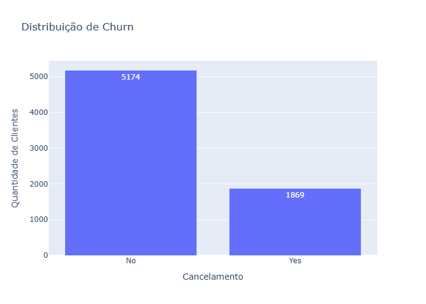
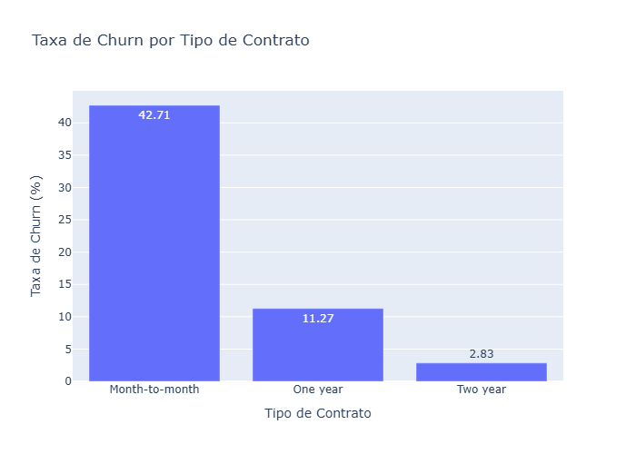
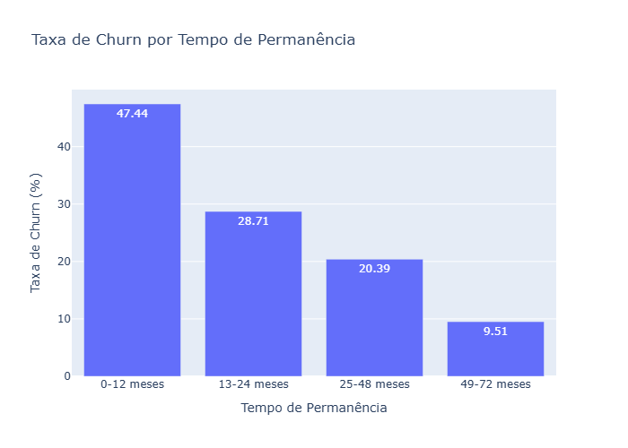
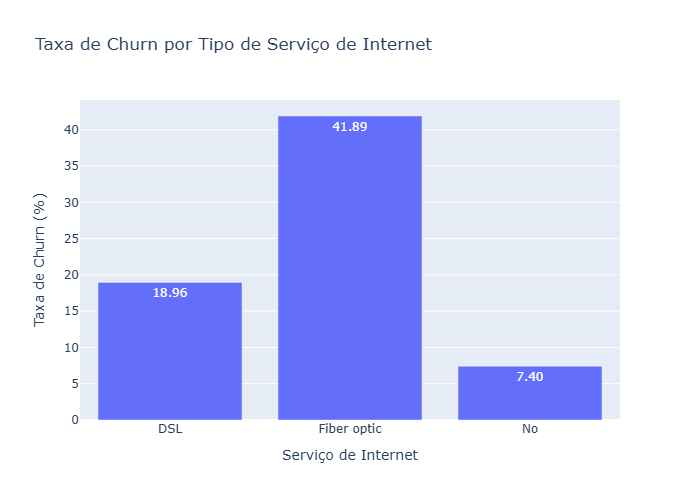
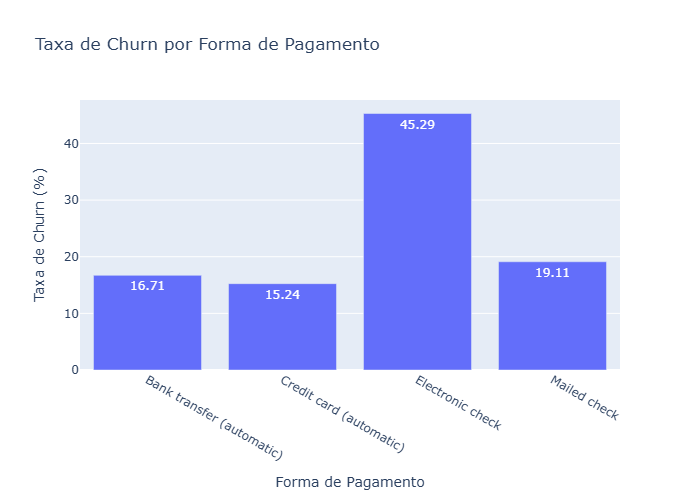

# Customer Churn Analysis

Análise exploratória de dados de clientes de uma empresa de telecomunicações com o objetivo de identificar padrões e características associados ao cancelamento de clientes (churn).

## Objetivo

Analisar o comportamento dos clientes e identificar os principais fatores associados ao churn, transformando os resultados da análise em insights e recomendações de negócio.

## Tecnologias Utilizadas

- Python
- Pandas
- Plotly
- Jupyter Notebook
- VS Code

## Dataset

O projeto utiliza o dataset Telco Customer Churn, contendo informações de 7.043 clientes de uma empresa de telecomunicações.

A base possui informações sobre perfil dos clientes, serviços contratados, tipo de contrato, forma de pagamento, tempo de permanência, valores cobrados e situação de cancelamento.

A variável `Churn` indica se o cliente cancelou ou não o serviço.


## Etapas da Análise

1. Importação e compreensão da base de dados
2. Exploração e avaliação da qualidade dos dados
3. Tratamento e preparação dos dados
4. Análise da taxa de churn
5. Análise dos fatores associados ao cancelamento
6. Criação de visualizações
7. Identificação dos principais achados
8. Elaboração de recomendações de negócio


## Principais Resultados

A taxa geral de churn observada foi de **26,54%**, com 1.869 cancelamentos entre 7.043 clientes.

Os principais fatores associados a maiores taxas de churn foram:

- **Contrato mensal:** 42,71%
- **Clientes com até 12 meses de permanência:** 47,44%
- **Fibra óptica:** 41,89%
- **Fibra óptica sem suporte técnico:** 49,37%
- **Electronic check:** 45,29%
- **Sem OnlineSecurity:** 41,77%

Os resultados indicam associações entre essas características e o cancelamento, não necessariamente relações de causa e efeito.


## Visualizações

### Distribuição de Churn



### Taxa de Churn por Tipo de Contrato



### Taxa de Churn por Tempo de Permanência



### Taxa de Churn por Tipo de Serviço de Internet



### Taxa de Churn por Forma de Pagamento




## Recomendações de Negócio

Com base nos padrões identificados na análise:

- **Incentivar contratos de maior duração:** oferecer benefícios para clientes de contrato mensal migrarem para planos anuais.
- **Priorizar a retenção nos primeiros 12 meses:** desenvolver ações de acompanhamento e fidelização para novos clientes.
- **Investigar a experiência dos clientes de fibra óptica:** avaliar possíveis fatores relacionados à elevada taxa de churn desse grupo.
- **Fortalecer o suporte técnico:** principalmente para clientes de fibra óptica.
- **Avaliar clientes que utilizam Electronic check:** investigar os motivos associados à maior taxa de churn observada nessa forma de pagamento.
- **Avaliar serviços de segurança online:** investigar oportunidades de retenção relacionadas ao serviço OnlineSecurity.


## Estrutura do Projeto

```text
customer-churn-analysis/
│
├── data/
│   └── Telco-Customer-Churn.csv
│
├── notebooks/
│   └── 01_exploracao_dados.ipynb
│
└── README.md
```